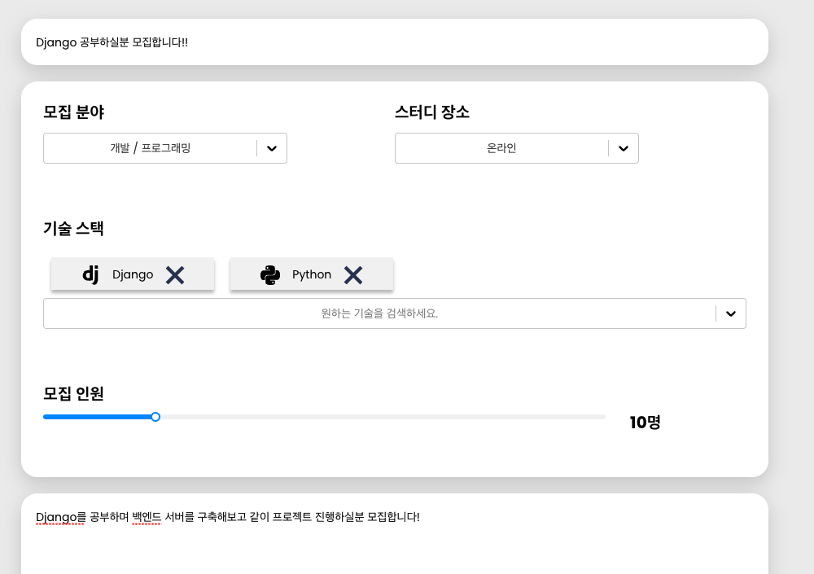
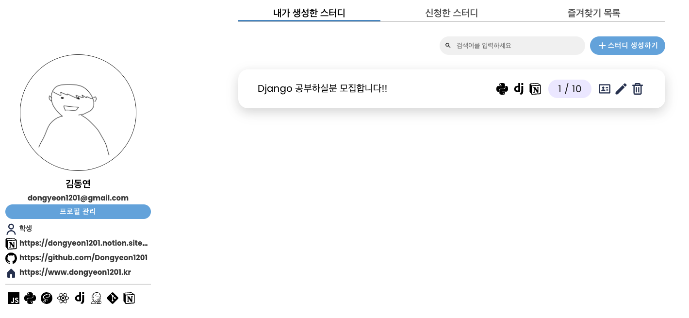
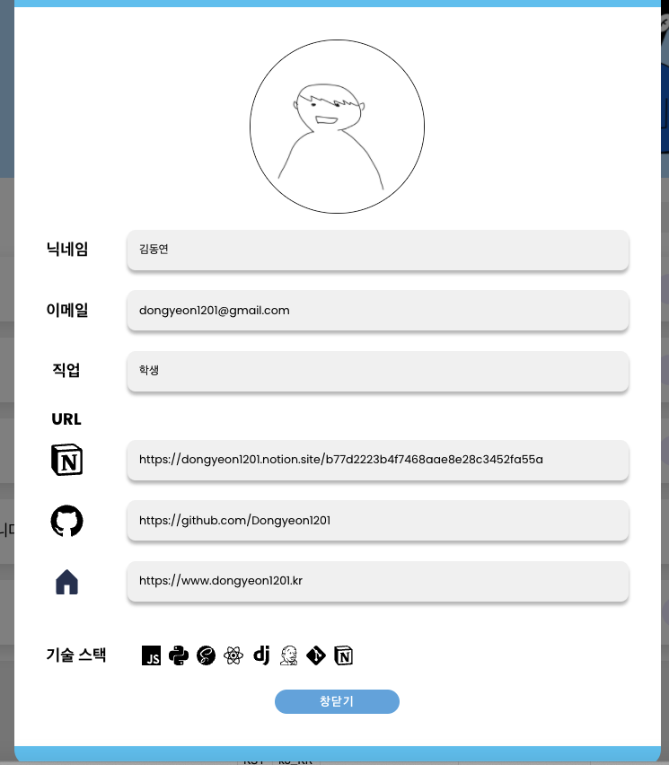
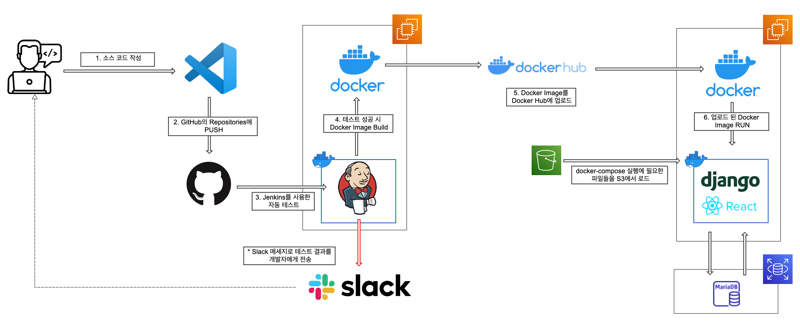

# ✏️ 캐치스터디

### 🤔 **내가 원하는 주제의 스터디는 없을까?**

나와 같은 목표를 가진 사람들과 함께 스터디를 시작해보세요.

원하는 주제를 선택하여 스터디를 생성하고, 모집할 수 있는 사이트입니다!

**사이트 링크** : [https://catchstudys.com/](https://catchstudys.com/)

- [백엔드(Django) Github](https://github.com/studysiteproject/DjangoAPI)

- [백엔드(Spring) Github](https://github.com/studysiteproject/SpringApi)

<br>

### 🧑‍💻 팀원

---

- **김동연**
    - **Blog** : [https://www.dongyeon1201.kr](https://www.dongyeon1201.kr)
    - **Github** : [https://github.com/Dongyeon1201](https://github.com/Dongyeon1201)
- **이종찬**
    - **Github** : [https://github.com/Lipeya](https://github.com/Lipeya)
- **임채민**
    - **Github** : [https://github.com/lacram](https://github.com/lacram)
<br>

**[ 백엔드(Spring) ]** : 이종찬, 임채민

**[ 백엔드(Django) ]** : 김동연

**[ 프론트(React) ]** : 김동연

**[ CI/CD 환경 구축(Jenkins) ]** : 김동연

**[ 기획, 디자인 ]** : 김동연, 이종찬, 임채민

<br>

### 📝 프로젝트때 작성한 문서 & 진행도

---

- [프로젝트 노션 기록](https://www.notion.so/91c98ac183cf43c1b6fe010fa40ff50d)
- [API Docs](https://www.notion.so/API-DOCS-e4d7c6948b99490e9af130151d62e750)

<br>

### 🏗️ 기능

---

- 원하는 기술 스택을 검색하여 스터디에 추가할 수 있습니다.

- 모집 인원과 설명을 같이 작성할 수 있습니다.
  
    

<br>

- 작성된 스터디에 댓글 작성과 즐겨찾기가 가능합니다.


<br>

- 내가 생성하거나 참가한 스터디를 관리할 수 있습니다.
  
    
    

<br>

- 타 사용자에 대한 정보를 확인하고 싶을 때 프로필 기능을 사용할 수 있습니다.

- 유저가 어떤 기술을 사용할 수 있는지, 블로그와 같은 URL은 어떤게 있는지 확인할 수 있습니다.

  

<br>

### 🏗️ CI/CD 설계

---



<br>

### 😎 프론트엔드를 만들며 경험한 것

---

- Redux를 이용한 여러 정보의 상태 관리
- 자주 사용되는 함수와 컴포넌트를 분리하여 관리하는법
- axios를 활용한 백엔드 서버와의 통신

<br>

### 🛠️ Django를 시용한 백엔드 구축 중 어려웠던 것

---

Redux를 이용한 상태관리가 프론트엔드를 진행하며 복잡했던 부분이었습니다.

단순히 한 두줄을 작성하면 자동으로 전역으로 상태를 관리를 해주지 않기 때문입니다.

사용하는 방법이 일반적으로 사용하는 `useState` 와는 다르게 Reducer 작성과 액션 설정도 필요하기 때문이었습니다.

저는 아래와 같이 Reducer를 작성하고, `createAction` 을 사용하여 **해당 동작을 수행하는 액션을 생성**해주었습니다.

- 스터디의 정보를 관리하는 Reducer의 일부
  
    ```jsx
    const INIT_ACTION = "INIT_ACTION";
    const SET_LIST = "SET_LIST";
    const CHANGE_FAVORITE = "CHANGE_FAVORITE";
    
    const INITIAL_STATE = {
        studylist : []
    }
    
    // 스터디 목록 얻어오기 액션
    const Initaction = createAction(INIT_ACTION);
    const SetList = createAction(SET_LIST, (data)=>({data}));
    const ChangeFavorite = createAction(CHANGE_FAVORITE, (id)=>({id}));
    
    export default function Reducer(state=INITIAL_STATE, action){
    
        switch(action.type){
            
            case SET_LIST:
                return {
                    ...state,
                    studylist: action.payload.data
                }
                
            case CHANGE_FAVORITE:
                
                // 입력한 index의 item 얻어오기
                const index = state.studylist.findIndex(studylist => studylist.id == action.payload.id)    
                const newArray = [...state.studylist];
    
                newArray[index].isfavorite = !newArray[index].isfavorite
    
                return { 
                    ...state, //copying the orignal state
                    studylist: newArray, //reassingning todos to new array
                }
            
            case INIT_ACTION:
                return {
                    ...state,
                    studylist: INITIAL_STATE
                }
    
            default:
                return {
                    ...state
                }           
        }
      
    }
    
    ...
    
    const StudyActionList = {
        Initaction,
        SetList,
        ChangeFavorite
    }
    export { StudyActionList }
    ```
    

<br>

`createAction` 으로 생성한 액션은 export 후, 아래와 같이 참조하여 사용하였습니다.

```jsx
...

// 해당 컴포넌트 최초 실행 시, 액션 실행
useEffect(() => {
      dispatch(StudyActionList.Initaction());
},[]);

...
```

<br>

이러한 Reducer들은 `index.js` 한 파일에서 관리하였습니다.

```jsx
import { combineReducers } from "redux";

import InfoReducer from './InfoReducer'
import StudyReducer from './StudyReducer'
import UserReducer from './UserReducer'

export default combineReducers({
    infoReducer : InfoReducer,
    studyReducer : StudyReducer,
    userReducer : UserReducer,
});
```

<br>

### **🛠 보완해야 할 점**

---

### 1. TypeScript로 바꾸지 못한 것

현재 프로젝트는 JS + React 라이브러리 조합으로 사용되었습니다. 

어느 정도 프로젝트가 진행되었을 때 TypeScript에 대한 여러 이야기를 듣게 되었습니다. 

하지만 기존 것을 전부 TypeScript로 바꾸고 새로운 기능을 만들기에는 혼자 프론트엔드와 Django 백엔드를 같이 진행하며 시간적으로 부족하였습니다. 

보완할 수 있는 기회가 된다면 TypeScript로 다시 작성해보고 싶습니다. 

### 2. Scss의 재사용성이 떨어진 문제 

프로젝트의 디자인적인 부분을 설계하면서, 팀원들과 Figma를 사용하였습니다. 

이때 Figma에서 자주 사용되는 부분은 따로 관리하였는데, 프론트엔드 Scss에서는 이러한 점이 반영되지 못하였습니다. 

이로 인해 비슷한 요소를 많이 사용하는 페이지에서도 Scss파일을 다시 작성하는 등 불필요한 시간을 소모하였으며, 가독성도 많이 저하되었습니다. 

버튼, 검색창, 팝업 등 자주 사용되는 요소들을 잘 파악해야 한다는 경험을 얻었습니다. 

### 3. 반응형으로 제작하지 못한 문제 

현재 캐치 스터디는 PC로 접속하였을 때만 정상적으로 확인이 가능하며, 작은 화면이나 모바일에서 접속하면 일부분이 잘리는 문제가 발생합니다. 

보완할 수 있는 기회가 된다면 모바일에서도 정상적으로 사용 가능하도록 반응형 웹으로 만들어보고 싶습니다.
